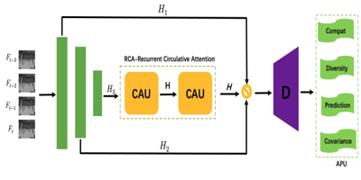
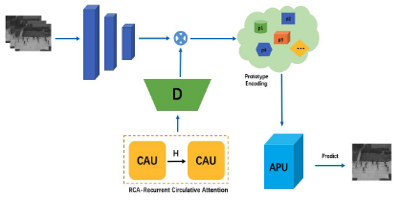
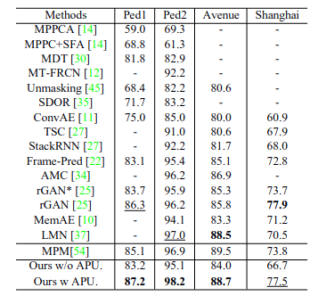

# Codes_APN
Official codes of CVPR21 paper: Normal Learning in Videos with Attention Prototype Network (https://arxiv.org/abs/2108.11055)  
  
Overview of our approach based on APU and CAU model:  


# Introduction
Frame reconstruction (current or future frame) based on Auto-Encoder (AE) is a popular method for video anomaly detection. With models trained on the normal data, the reconstruction errors of anomalous scenes are usually much larger than those of normal ones. Previous methods introduced the memory bank into AE, for encoding diverse normal patterns across the training videos. However, they are memory consuming and cannot cope with unseen new scenarios in the testing data. In this work, we propose a self-attention prototype unit (APU) to encode the normal latent space as prototypes in real time, free from extra memory cost. In addition, we introduce circulative attention mechanism to our backbone to form a novel feature extracting learner, namely Circulative Attention Unit(CAU). It enables the fast adaption capability on new scenes by only consuming a few iterations of update. Extensive experiments are conducted on various benchmarks. The superior performance over the state-of-the-art demonstrates the effectiveness of our method.

# Performance
  
We achieved SOTA on many video anomaly detection datasets.

# Unsupervised Anomaly Detection Model Training
```
bash train.sh
```
# Unsupervised Anomaly Detection Model Testing
```
bash test.sh
```

If you find this work helpful, please cite:
```
@inproceedings{Nv2021APN,
  author    = {Chao Hu and
	             Fan Wu and
               Weijie Wu and
               Weibin Qiu and
               Shengxin Lai},
  title     = {Normal Learning in Videos with Attention Prototype Network},
  booktitle = {Computer Vision and Pattern Recognition},
  year      = {2021}
}
```
